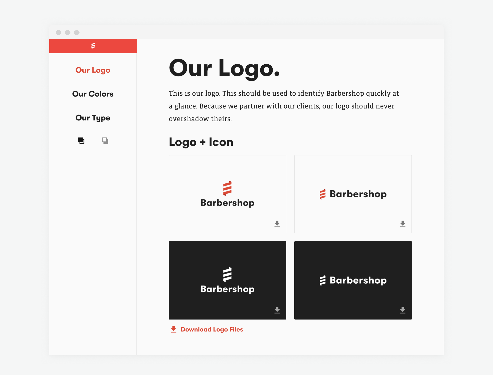
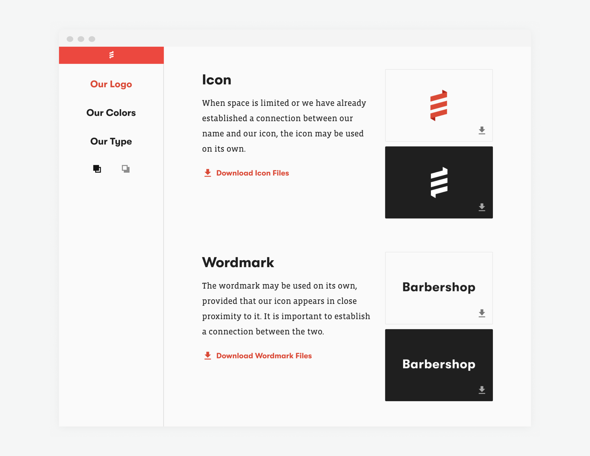
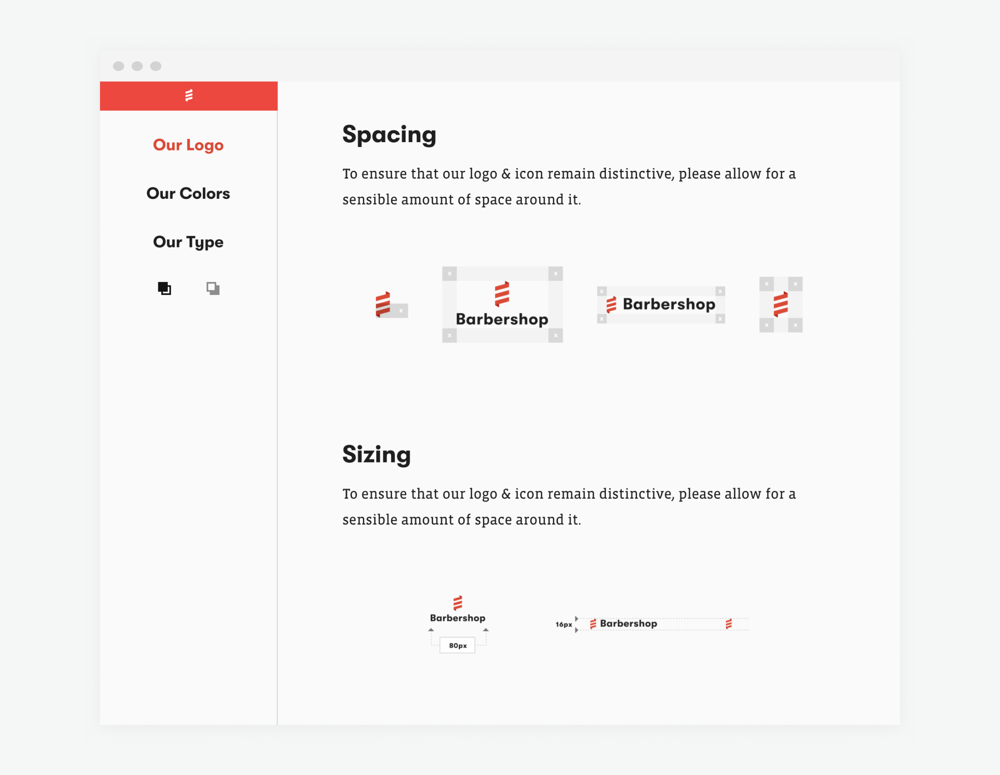
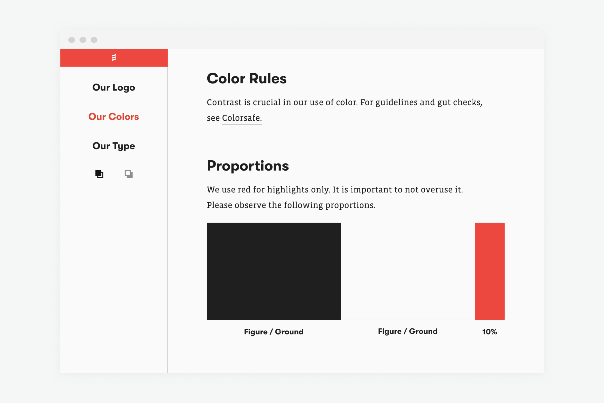

Barbershop hired an independent contractor to re-design our website, which led to a larger discussion of how we present ourselves to potential clients and partners. Using the website redesign as a jumping-off point, I worked with Barbershop’s leadership to create a digital style guide and resource repository to make it easier for our team to collaborate on internal projects.

I worked with our Chief Creative Officer to solidify our brand standards. After a rapid-fire design review, I prepped all the necessary assets and build the site.

