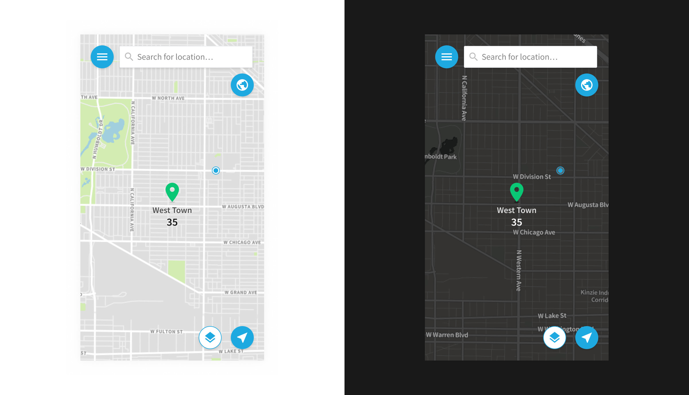

GeoSure is a mobile app that empowers individuals to travel with confidence by providing objective, personalized, real-time information about neighborhoods, cities, and countries the world over. Our relationship began with a re-design of the old GeoSure app in 2017 and continued the following year with the addition of “premium” features for enterprise. The initial redesign scrapped all the previous app’s styling and established a fresh perspective on GeoSure’s digital presence.

In the first round of redesign, I coordinated with the GeoSure team to translate their recent re-branding efforts into a component library that adheres to ADA guidelines while staying true to the visual direction of the brand. I designed the experience of the initial features, as well as the new features in round two, and was responsible for overall visual direction and execution of the app. For user on-boarding flows and empty states, I created a set of illustrations and icons.

