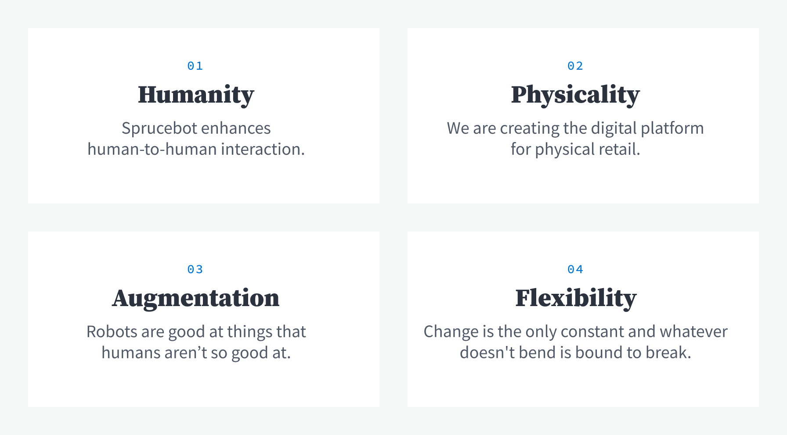
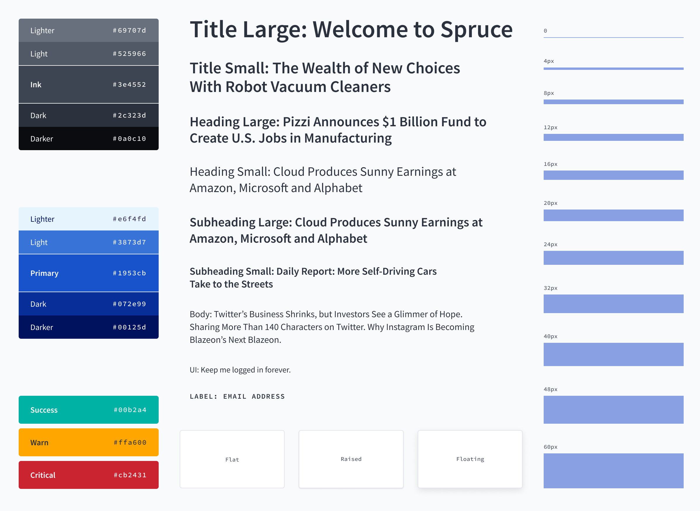
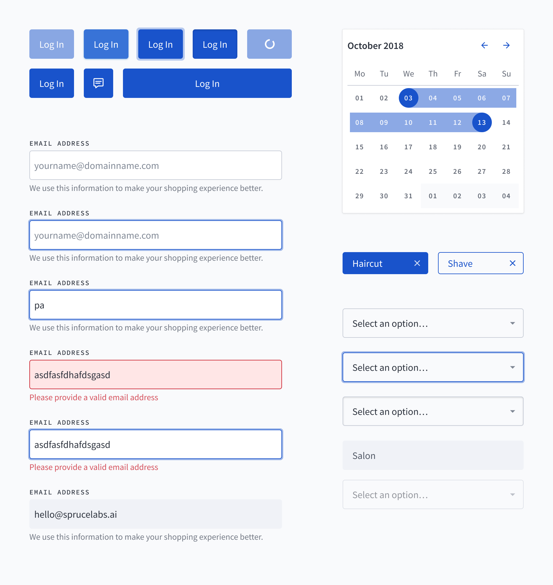
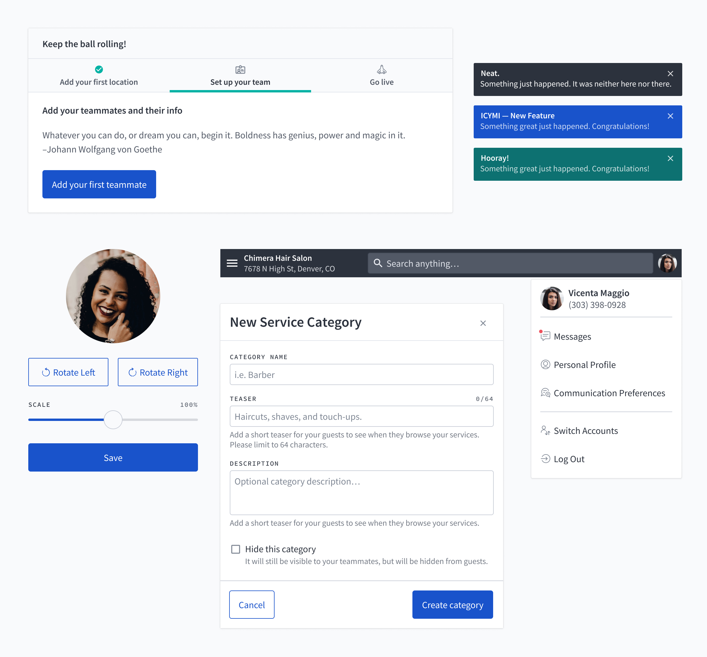
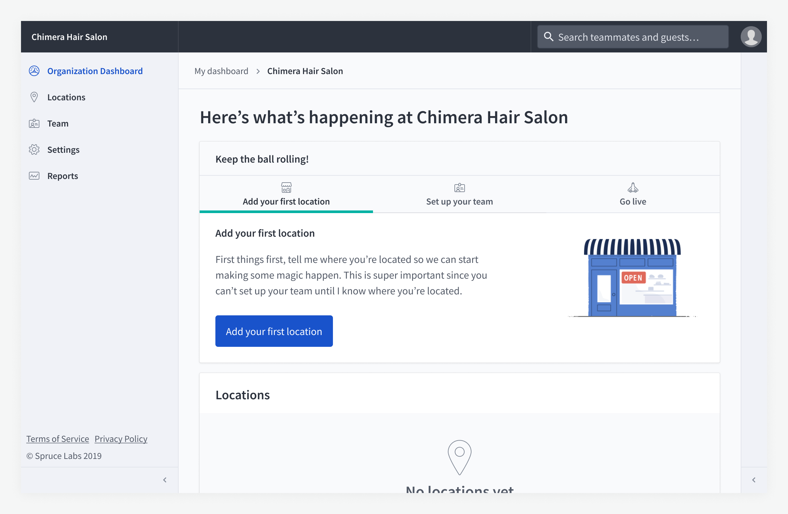
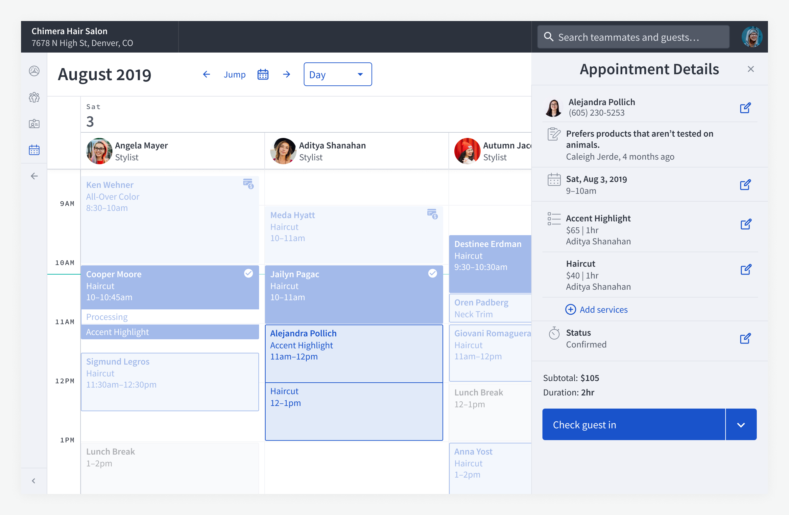

import Header from '../components/Header';

<Header showMailto />

# Hello Earl

Heartwood is the design system for Spruce Labs' digital product suite. The goal of the design system is to streamline communication and workflow across the company's creative, product, and engineering teams, while ensuring a cohesive product experience for users. To create Heartwood, I started by examining the first principles of Spruce. These serve as a North Star against which to measure every design decision from the foundation up.

The key considerations in creating the foundational styles of Heartwood were physicality and accessibility. The former is crucial, because the product solves problems for physical businesses, while the latter adds value for users by making the product easy to use.

I designed the initial Heartwood components to solve the most common design problems for a digital product. Triggering actions, taking user input, and displaying structured information were obvious first steps.

As Heartwood began to be adopted into the product, new needs became clear. These were addressed by taking the foundational style and component designs and using them to build more specialized components that solve nuanced and contextual problems, such as adding friction to destructive actions and confirming changes that affect user experience.

With the first version of Heartwood in place, it became much easier for our team to collaborate and move forward on iterations of the platform. These new features in turn have informed the future roadmap of Heartwood.

